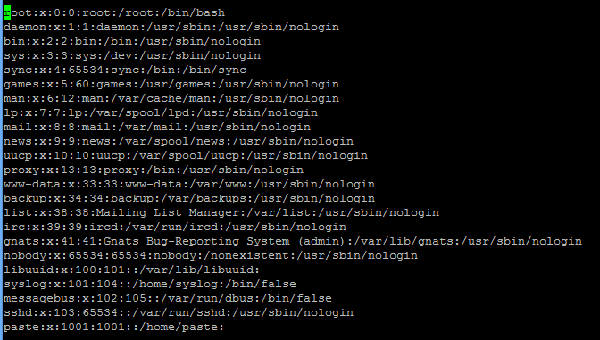
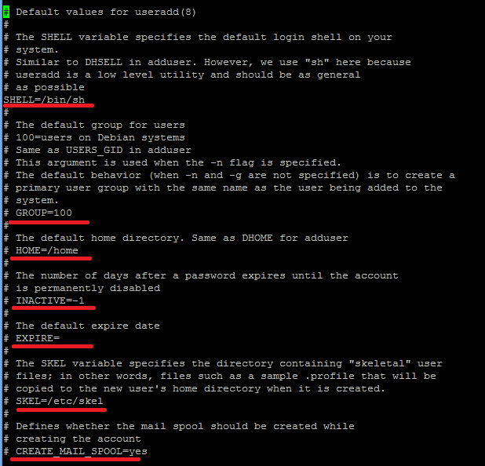
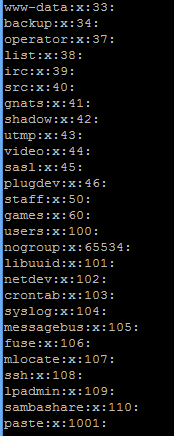

# Tìm hiểu về command tạo, sửa, xóa user và group  
#### I.Lệnh quản trị User và Group
**useradd**  
    Lệnh tạo user mới, mặc định khi bạn thêm một **User** mới vào thì **User** này sẽ sở nằm trong một group với tên trùng tên user  
    ```
        # useradd <Tên user mới>
    ```  
    Ngay sau khi tạo user mới ta cần phải đặt mật khẩu cho nó  
    Đặt mật khẩu mới  
    ``` 
        # passwd <Tên user cần đặt >pass
    ```  
    Tạo user với thư mục tùy chọn  
    ```
        # useradd -d /<tên thư mục> <tên user>
    ```  
    Tạo user group tùy chọn  
    ```
        # useradd -G <tên group> <tên user>
    ```  
    Tạo một user không tạo ra thư mục riêng  
    ```
        # useradd -M <tên user>
    ```  
    Tạo user và tự khóa vào ngày nhất định  
    ```
        # useradd -e <năm-tháng-ngày> <tên user>  
    ```  
    Tạo group mới  
    ```
        # groupadd <Tên group mới>
    ```  
    Xóa group  
    ```
        # groupdel <ten group>
    ```  
#### II.Một số file liên quan đến user và group  
   **File/etc/passwd**  
    Để kiểm tra xem user của bạn đã thật sự thêm được vào chưa,ta sẽ kiểm tra file **etc/passwd**  
    ```
        # cat /etc/passwd  
    ```  
    Trong file passwd sẽ hiển thị toàn bộ user có trên VPS kèm theo quyền và tên nhóm của nó  
        
    Cấu trúc file như sau:  
    **UserName : Password : UserID : GroupID : Comments : HomeDirectory : Shell**  
    1.Username: tên đăng nhập, phân biệt Hoa/thường, nên dùng chữ thường.  
    2.Password: lưu chỗi passwd đã has, nếu có sử dụng /etc/shadow thì ở đây sẽ là chữ x  
    3.User ID: hệ thống dùng user ID để phân biệt người này với người khác  
    4.Group ID: Đây là nhóm chính của user này.  
    5.Comment: Mô tả cho user.  
    6.Home Directory: Thư mục home của từng user, thường sẽ nằm trong /home/tenuser  
    7.Shell: Tên chương trình sẽ thực thi ngay sau khi user login vào. Nếu không có shell user sẽ không thể login.  
    Mặc nhiên trên linux sẽ dùng bash shell ở đây.  
    **File /etc/default/useradd**  
    Để cấu hình user ta sẽ xem file **/etc/default/useradd**  
    ```
        # cat /etc/default/useradd
    ```   
      
    
   **Nội dung file như sau:**  
   1.Shell: là một hệ vỏ mặc định mà user sẽ được sử dụng. Bạn cứ hiểu là khi vào SSH, bạn gõ các dòng lệnh  
   Linux vào và thực thi, đó chính là bạn đang dùng Shell. Nếu bạn không muốn user được tạo ra có quyền sử dụng  
   Shell thì để trống phần này.  
   2.Group: là ID của group mặc định mà user sẽ được đưa vào khi tạo ra.  
   3.Home: Đường dẫn mặc định chứa các thư mục của từng thành viên khi tạo ra.  
   4.Inactive: Thời gian mà tài khoản sẽ bị khóa vĩnh viễn sau khi mật khẩu của thành viên đó hết hạn.  
   5.Expire: Ngày mà tài khoản của thành viên được tạo ra mặc định sẽ bị khóa. Cấu trúc ngày tháng ở đây là YYYY-MM_DD  
   6.Skel: Thư mục mẫu của user mà khi tạo ra, user sẽ tự động coppy các file và thư mục trong đây vào thư mục /home/tên-user  
   7.Create_mail_spool: cho thành viên được phép sử dụng mail trên server nếu tùy chọn là yes.Mail sẽ được lưu trong file /var/mail/tên-user hoặc /var/spool/mail/tên-user.  
   **file/ect/group**  
   **/etc/group** là file chưa các thông tin về group  
   ```# cat /etc/group```  
     
   Cấu trúc của nó như sau:
   **GroupName : Password : GroupID : User1,User2,...**  
   1.Groupname:tên nhóm  
   2.Passwd: lưu chuỗi passwd, chỗ này được ghi là x  
   3.Gruop ID: ID của nhóm  
   4.User: Danh sách các user nhận group này là secondary, ngăn cách nhau bằng dấu phẩy  
   
     