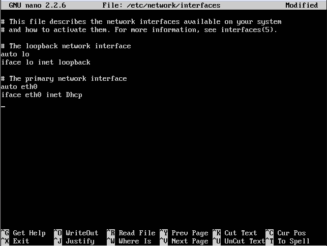
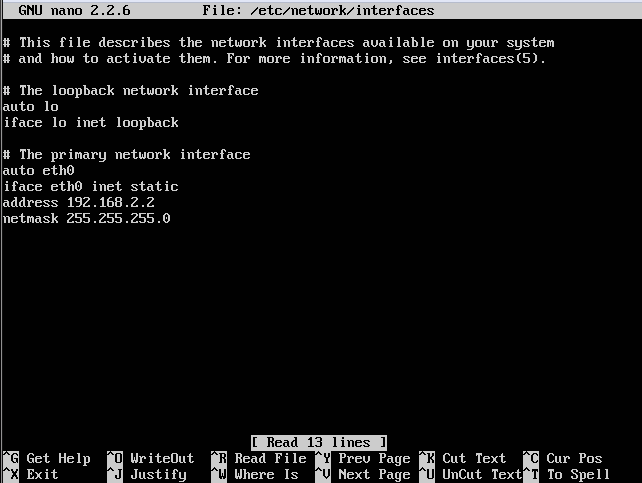
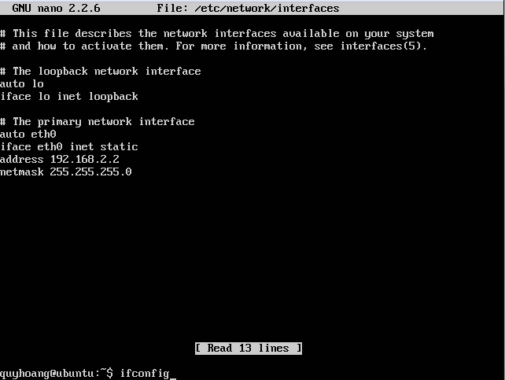
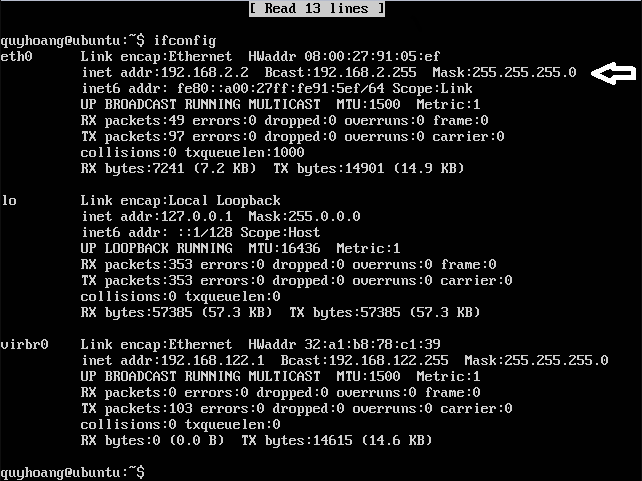

# Hướng dẫn đặt địa chỉ IP tĩnh trên Ubuntu Server  

Đầu tiên, các bạn khởi động hdh UBUNTU SERVER lên, login vào hdh bằng **Username** và **Password** của bạn!  

    
  
Tiếp theo, nhập vào lệnh sau : **sudo nano /etc/network/interfaces** và nhập **password** của bạn vào  

    
  
Chương trình sẽ xuất hiện như thế này  

    
  
Ở đây bạn sẽ thiết lập thông số địa chỉ IP tĩnh của bạn !  
Ở phần **#The primary networks interface :**  
-Sửa **dhcp** thành **static**  

Thêm các thông tin sau:  
-**address 192.168.2.2** (địa chỉ ip là tùy vào cách thiết lập của bạn -ở đây mình chọn 192.168.2.2)  
-**netmask 255.255.255.0**  
-**getway 192.168.1.1** (có thể có hoặc không -tùy vào tính chất công việc của bạn)  

Kết quả sẽ được thế này:  

    
  
Nhấn `esc` và wq để lưu lại và thoát  

Sau đó bạn restart lại bằng câu lệnh sau: **sudo /etc/init.d/networking restart**  
Như vậy bạn đã thiết lập thành công địa chỉ IP tĩnh của bạn  
Để kiểm tra lại kết quả Config bạn sử dụng lệnh sau: **ifconfig**  
  
    
  
Kết quả sẽ như thế này   

  